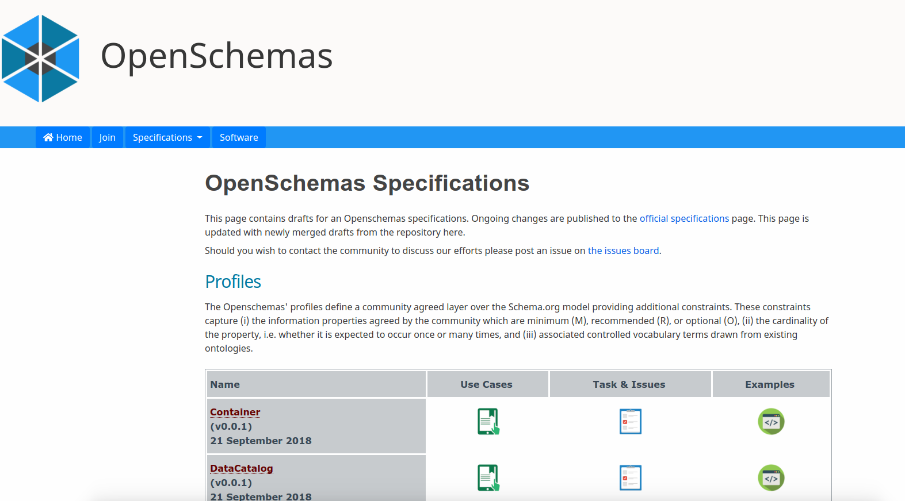
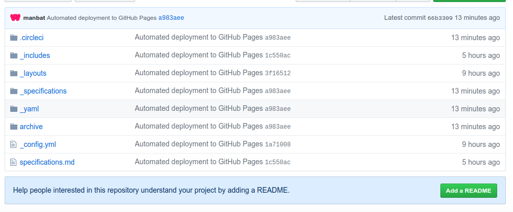
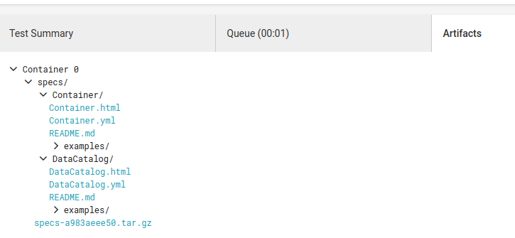

# OpenSchema Specification Builder Template


This is a template for the [openschemas/schema-builder](https://www.github.com/openschemas/schema-builder)
to generate a schema.org specification using [map2model](https://www.github.com/openschemas/map2model) 
for a dummy entity called "Template" that is represented in a subfolder named equivalently.

 - [Template](specifications/Template)

You can also see the [spec-container](https://www.github.com/openschemas/spec-template) repository
for an actual instance (with Github pages and archive active) for this template in action.

## Usage

### 1. Generate your Front Matter
Edit the file [configuration.yml](specifications/configuration.yml) in 
the [specifications](specifications) directory and fill in the values for your
specification. Are you editing or contributing more than one? Feel free to copy paste the chunk
(not including the "specifications" header) and have more than one.

### 2. Write your specification!
Now generate your new template! You can create a copy of the Google Drive template [provided here](https://docs.google.com/spreadsheets/d/1seHDwKRwET_H8maRTMmdXG7M1deh23Y613TaJ2Pd3qc/edit?usp=sharing).

### 3. Download to your Computer
When you are done, **export each sheet** as a tsv file (tab separated value) and drop into a subfolder named by your specification (e.g., "[Template](specifications/Template)" is a folder in [specifications](specifications). When you are done, you will have something like this:

```
specifications/
├── configuration.yml
└── MySpecification
    ├── MySpecification - Authors.tsv
    ├── MySpecification - Bioschemas.tsv
    ├── MySpecification - Mapping.tsv
    └── MySpecification - Specification.tsv
```

(with optionally more than one specification subfolder!, each with an entry in the configuration.yml file.

### 4. Connect to CircleCI

You now can connect to continuous integration ([CircleCI](https://circleci.com/docs/enterprise/quick-start/#adding-a-project)), which automatically runs the [openschemas/schema-builder](https://hub.docker.com/r/openschemas/schema-builder) container. You will also need to:
   - (optional) define `GITHUB_USER` and `GITHUB_EMAIL` as CircleCI environment variables under settings for a "bot Github account" that you can use to push content back to Github Pages
   - After you add the variables, add the Github bot user to your repository as a collaborator
   - In a different browser, accept the invitation, and then copy paste the CircleCI URL for the project and click "Follow Project"
   - Finally, under the CircleCI project settings (still as the bot) click on Checkout SSH Keys and generate a key for the bot to use.

With this setup, you will automatically generate a mini site that mimicks the [openschemas.github.io](https://openschemas.github.io) to share your specifications.



Importantly, if you look at the Github pages branch, you have a folder of your specification files, 
along with a folder of the rendered templates (that you can submit to `openschemas.github.io` 
for final contribution of your schema!



But never fear if you don't want to connect to Github pages, these same files are saved as "artifacts"
under the circle build (make sure to look under the build step of the workflow):



How does this workflow all happen? Take a look at the files in the [.circleci](.circleci) folder. The 
[config.yml](.circleci/config.yml) is the main driver, and the rest of the files are supporting to create
the web interface.

Please see the [spec-container](https://www.github.com/openschemas/spec-template) repository
for an actual instance (with Github pages and archive active) for this template in action.

## Support
If you want to get help with your specification, you have many sources available to you!
 - we are happy to host the specification here (as a repository called `spec-*` under the openschemas organization. Open [an issue](https://www.github.com/openschemas/specifications/issues) and we will jump on it.
 - For biological sciences, your best bet is to connect with the [BioSchemas](http://bioschemas.org) crew. 

## Contribute!
Finally, we want to contribute our specifications! This is actually much easier than you
might think. Just grab the file on github pages (or as an artifact) that corresponds to `*.html` 
(e.g `MySpecification.html`). And then:

 1. Fork the [specifications](https://www.github.com/openschemas/specifications) repository.
 2. Check out a new branch, add the file to the `_specifications` folder, push
 3. Open a pull request to [specifications](https://www.github.com/openschemas/specifications)!

That should be it! We are in the process of writing tests so that the contributions there
will be properly tested. Stay tuned!
